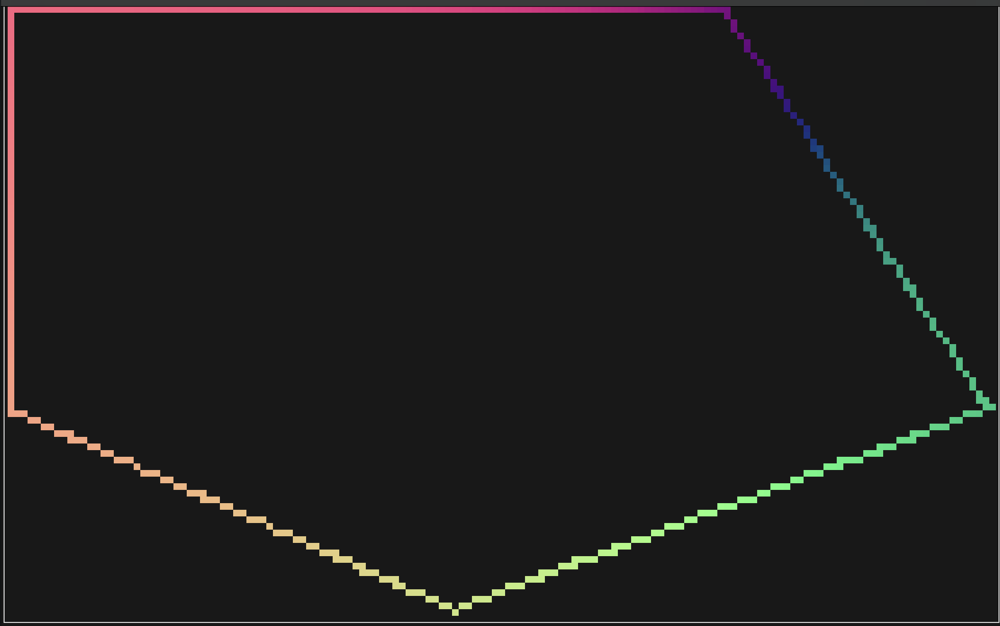
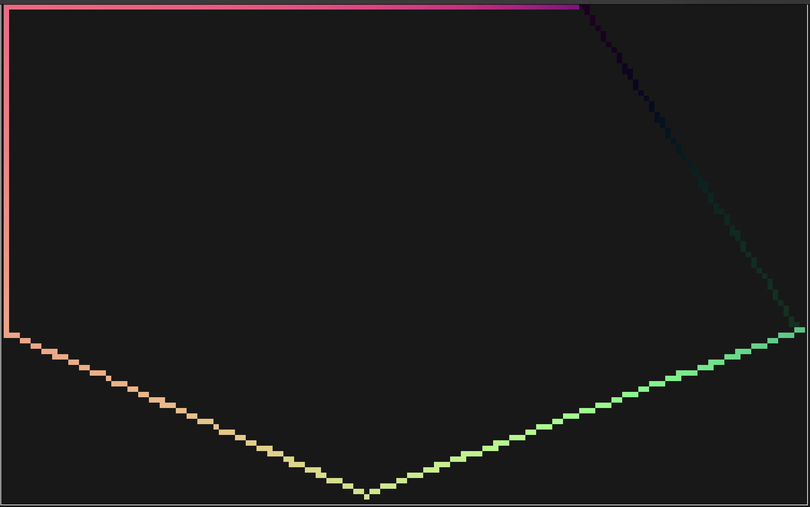
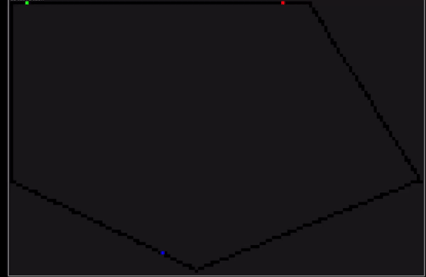

[](https://crates.io/crates/spatial_led)
[](https://github.com/DavJCosby/sled#License)
[](https://docs.rs/spatial_led/latest/spatial_led/)
[](https://github.com/DavJCosby/sled/actions/workflows/rust.yml)

# Spatial LED (Sled)
<div>  
 </div>
Sled is an ergonomic rust library that maps out the shape of your LED strips in 2D space to help you create stunning lighting effects.

### What Sled **does**:
- It exposes an API that lets you:
	- Compute colors depending on each LED's position, distance, direction, line segment, etc;
	- Output colors via a simple, contiguous iterator for your own usage;
	- Filter LEDs by spatial properties to predefine important sets and regions for faster computation;
- Additionally, some tools are provided to help you build functional apps faster (you may opt-out via [compiler features](https://doc.rust-lang.org/cargo/reference/features.html)):
	- [Driver](#drivers) - Pack draw/compute logic into a Driver to simplify the process of swapping between effects, or changing effect settings at runtime. 
	- [Scheduler](#scheduler) - Lightweight tool to schedule redraws at a fixed rate, powered by [spin_sleep](https://github.com/alexheretic/spin-sleep).

### What Sled does *not* do:
- It does not interface directly with your GPIO pins to control your LED hardware. Each project will be different, so it's up to you to bring your own glue. Check out the [Raspberry Pi example](https://github.com/DavJCosby/spatial_led_examples/tree/main/raspberry_pi) to get an idea what that might look like.
- It does not allow you to represent your LEDs in 3D space. Could be a fun idea in the future, but it's just not planned for the time being.

> This project is still somewhat early in development so please report any bugs you discover! Pull requests are more than welcome!

See the [spatial_led_examples](https://github.com/DavJCosby/spatial_led_examples) repository for examples of Sled in action!

## The Basics
In absence of an official guide, this will serve as a basic introduction. From here, you can consult the [docs](https://docs.rs/spatial_led/latest/spatial_led/) to learn what else Sled can do.
### Setup
To create a Sled struct, you need to create a configuration file and provide its path to the constructor:
```rust
use spatial_led::<Sled, SledError>;
use palette::rgb::Rgb;
fn main() -> Result<(), SledError> {
    let mut sled = Sled::<Rgb>::new("/path/to/config.yap")?;
    Ok(())
}
```

A configuration file explains the layout of your LED strips in 2D space. This is used to pre-calculate some important information, speeding up complex draw calls.

 Example config file:
 ```
center: (0.0, 0.5)
density: 30.0
--segments--
(-2, 0) --> (0.5, -1) --> (3.5, 0) -->
(2, 2) --> (-2, 2) --> (-2, 0)
 ```
 > For more information on how to write config files in this format, check out the [docs](https://docs.rs/spatial_led/latest/spatial_led/struct.Sled.html#method.new).
### Drawing
Once you have your Sled struct, you can start drawing to it right away! Here’s a taste of some of the things Sled lets you do:

**Set all vertices to white:**
```rust
sled.set_vertices(Rgb::new(1.0, 1.0, 1.0));
```

> Note that this is a custom terminal UI visualization that is not packaged as part of the sled library. It is ultimately up to you to decide how to visualize your LEDs; Sled just handles the computation.

**Set all LEDs 2 units away from the `center_point` to red:**
```rust
sled.set_at_dist(2.0, Rgb::new(1.0, 0.0, 0.0));
// or relative to any other point using:
// sled.set_at_dist_from(distance, pos, color)
```


**Set each LED using a function of its direction from point `(2, 1)`:**
```rust
sled.map_by_dir_from(Vec2::new(2.0, 1.0), |dir| {
    let red = (dir.x + 1.0) * 0.5;
    let green = (dir.y + 1.0) * 0.5;
    Rgb::new(red, green, 0.5)
});
```


**Dim one of the walls by 75%:**
```rust
sled.modulate_segment(3, |led| led.color * 0.25)?;
```


**Set all LEDs within the overlapping areas of two different circles to blue:**
```rust
let circle_1: Filter = sled.within_dist_from(
    2.0,
    Vec2::new(1.0, 0.5)
);
    
let circle_2: Filter = sled.within_dist_from(
	2.5,
	Vec2::new(-1.0, 1.5)
);

let overlap = circle_1.and(&circle_2);
sled.set_filter(&overlap, Rgb::new(0.0, 0.0, 1.0));
```

For more examples, see the documentation comments on the Sled struct.

## Output
Once you’re ready to display these colors, you’ll probably want them packed in a nice contiguous array of RGB values. There are a few methods available to pack the information you need.

```rust
let colors_f32 = sled.colors();
// An Iterator of Rgbs, 32-bits/channel

for color in colors_f32 {
    let red: f32 = color.red;
    // -snip- //
}
```

A few other handy output methods:
```rust
let leds = sled.leds();
// An Iterator of Led structs (holds color, position, distance/angle relative from center, etc)

let colors_u8 = sled.colors_coerced::<u8>();
// An Iterator of Rgbs, 8-bits/channel

let positions = sled.positions();
// An Iterator of Vec2s, representing the position of each LED

let colors_f32_and_positions = sled.colors_and_positions();
// An Iterator of (Rgb, Vec2) tuple pairs representing each LEDs color and position.

let colors_f32_and_positions = sled.colors_and_positions_coerced::<u8>();
// An Iterator of (Rgb<u8>, Vec2) tuple pairs representing each LEDs color and position.
```

# Advanced Features
For basic applications, the Sled struct gives you plenty of power. Odds are though, you'll want to create more advanced effects that might be time or user-input driven. A few optional (enabled by default, opt-out by disabling their compiler features) tools are provided to streamline that process.

## Drivers
Drivers are useful for encapsulating everything you need to drive a lighting effect all in one place. Here's an example of what a simple one might look like:

```rust
let mut driver = Driver::new();
use spatial_led::driver_macros::*;

driver.set_startup_commands(|_sled, buffers, _filters| {
    let colors = buffers.create_buffer::<Rgb>("colors");
    colors.extend([
        Rgb::new(1.0, 0.0, 0.0),
        Rgb::new(0.0, 1.0, 0.0),
        Rgb::new(0.0, 0.0, 1.0),
    ]);
    Ok(())
});

driver.set_draw_commands(|sled, buffers, _filters, time_info| {
    let elapsed = time_info.elapsed.as_secs_f32();
    let colors = buffers.get_buffer::<Rgb>("colors")?;
    let num_colors = colors.len();
    // clear our canvas each frame
    sled.set_all(Rgb::new(0.0, 0.0, 0.0));

    for i in 0..num_colors {
        let alpha = i as f32 / num_colors as f32;
        let angle = elapsed + (2.0 * PI * alpha);
        sled.set_at_angle(angle, colors[i]);
    }
    Ok(())
});
```
To start using the Driver, give it ownership over a Sled using `.mount()` and use `.step()` to manually refresh it.
```rust
let sled = Sled::<Rgb>::new("path/to/config.yap")?;
driver.mount(sled); // sled gets moved into driver here.

loop {
    driver.step();
    let colors = driver.colors();
    // display those colors however you want
}
```



`.set_startup_commands()` - Define a function or closure to run when `driver.mount()` is called. Grants mutable control over Sled, BufferContainer, and Filters.

`set_draw_commands()` - Define a function or closure to run every time `driver.step()` is called. Grants mutable control over Sled, and immutable access to BufferContainer, Filters, and TimeInfo.

`set_compute_commands()` - Define a function or closure to run every time `driver.step()` is called, scheduled right before draw commands. Grants immutable access to Sled, mutable control over BufferContainer and Filters and immutable access to TimeInfo.

If you need to retrieve ownership of your sled later, you can do:
```rust
let sled = driver.dismount();
```

> If you don't need Drivers for your project, you can shed a dependency or two by disabling the `drivers` compiler feature.

For more examples of ways to use drivers, see the [driver_examples folder](https://github.com/DavJCosby/spatial_led_examples/tree/main/driver_examples) in the spatial_led_examples repository.

### Driver Macros
Some macros have been provided to make authoring drivers a more ergonomic experience. You can apply the following attributes to functions that you want to use for driver commands:
* `#[startup_commands]`
* `#[compute_commands]`
* `#[draw_commands]`

Using these, you can express your commands as a function that only explicitly states the parameters it needs. The previous example could be rewritten like this, for example:
```rust
use spatial_led::driver_macros::*;
use spatial_led::{BufferContainer, SledResult, TimeInfo};

#[startup_commands]
fn startup(buffers: &mut BufferContainer) -> SledResult {
    let colors = buffers.create_buffer::<Rgb>("colors");
    colors.extend([
        Rgb::new(1.0, 0.0, 0.0),
        Rgb::new(0.0, 1.0, 0.0),
        Rgb::new(0.0, 0.0, 1.0),
    ]);
    Ok(())
}

#[draw_commands]
fn draw(sled: &mut Sled, buffers: &BufferContainer, time_info: &TimeInfo) -> SledResult {
    let elapsed = time_info.elapsed.as_secs_f32();
    let colors = buffers.get_buffer::<Rgb>("colors")?;
    let num_colors = colors.len();
    // clear our canvas each frame
    sled.set_all(Rgb::new(0.0, 0.0, 0.0));

    for i in 0..num_colors {
        let alpha = i as f32 / num_colors as f32;
        let angle = elapsed + (2 * PI * alpha);
        sled.set_at_angle(angle, colors[i])?;
    }
    Ok(())
}

//--snip--//

let mut driver = Driver::new();
driver.set_startup_commands(startup);
driver.set_draw_commands(draw));
```

### Buffers
A driver exposes a data structure called `BufferContainer`. A BufferContainer essentially acts as a HashMap of `&str` keys to Vectors of any type you choose to instantiate. This is particularly useful for passing important data and settings in to the effect.

It's best practice to create buffers with startup commands, and then modify them either through compute commands or from outside the driver depending on your needs.

```rust
#[startup_commands]
fn startup(sled: &mut Sled, buffers: &mut BufferContainer) -> SledResult {
    let wall_toggles: &mut Vec<bool> = buffers.create_buffer("wall_toggles");
    let wall_colors: &mut Vec<Rgb> = buffers.create_buffer("wall_colors");
    let some_important_data = buffers.create_buffer::<MY_CUSTOM_TYPE>("important_data");
    Ok(())
}

driver.set_startup_commands(startup);
```

To access buffers from outside driver, just do:
```rust
let buffers: &BufferContainer = driver.buffers();
// or
let buffers: &mut BufferContainer = driver.buffers_mut();
```

Using a BufferContainer is relatively straightforward.
```rust
let draw_commands = |sled, buffers, _, _| {
    let wall_toggles = buffers.get_buffer::<bool>("wall_toggles")?;
    let wall_colors = buffers.get_buffer::<Rgb>("wall_colors")?;
    let important_data = buffers.get_buffer::<MY_CUSTOM_TYPE>("important_data")?;

    for i in 0..wall_toggles.len() {
        if wall_toggles[i] == true {
            sled.set_segment(i, wall_colors[i])?;
        } else {
            sled.set_segment(i, Rgb::new(0.0, 0.0, 0.0))?;
        }
    }
    
    Ok(())
}
```

If you need to mutate buffer values:
```rust
// Mutable reference to the whole buffer
let buffer_mut = buffers.get_buffer_mut::<bool>("wall_toggles")?;

// Modify just one item
buffers.set_buffer_item("wall_toggles", 1, false)?;

// Mutable reference to just one item
let color: &mut Rgb = buffers.get_buffer_item_mut("wall_colors", 2)?;
*color /= 2.0;
```

### Filters
For exceptionally performance-sensitive scenarios, Filters can be used to predefine important LED regions. They act as sets, containing only the indicies of the LEDs captured in the set. When we want to perform an operation on that set, we pass the Filter back to the Sled like this:

```rust
let all_due_north: Filter = sled.at_dir(Vec2::new(0.0, 1.0));
sled.for_each_in_filter(&all_due_north, |led| {
    led.color = Rgb::new(1.0, 1.0, 1.0);
});
```
> Note that other methods exist like `.set_filter(filter, color)`, `.modulate_filter(filter, color_rule)`, and `.map_filter(filter, map)`

The `Filters` struct provided by Driver is basically a hashmap of `&str` keys to Sled `Filter` structs. Using this, we can pre-compute important sets and then store them to the driver for later usage.


A slightly better example would be to imagine that we have an incredibly expensive mapping function that will only have a visible impact on the LEDs within some radius $R$ from a given point $P$. Rather than checking the distance of each LED from that point every frame, we can instead do something like this:

```rust
let startup_commands = |sled, buffers, filters| {
    let area: Filter = sled.within_dist_from(5.0, Vec2::new(-0.25, 1.5));

    filters.set("area_of_effect", area);
    Ok(())
};

let draw_commands = |sled, buffers, filters, _| {
    let area_filter = filters.get("area_of_effect")?;
    sled.map_filter(area_filter, |led| {
        // expensive computation
    });
    Ok(())
};
```
Most `.get` methods on sled will return a Filter, but if you need more precise control you can do something like this:
```rust
let even_filter = sled.filter(|led| led.index() % 2 == 0);
```

I imagine this feature will get less love than buffers, but I can still see a handful of scenarios where this can be very useful for some users. In a future version this may become an opt-in compiler feature.

## Scheduler
The Scheduler struct makes it super easy to schedule redraws at a fixed rate.

```rust
let mut scheduler = Scheduler::new(120.0);

scheduler.loop_forever(|| {
    driver.step();
});
```
Scheduler, by default, utilizes [spin_sleep](https://crates.io/crates/spin_sleep/) to minimize the high CPU usage you typically see when you spin to wait for the next update by default.

Here are a few other methods that you might also consider:

```rust
// loops until false is returned
scheduler.loop_while_true(|| {
    // -snip- //
    return true;
});

// loops until an error of any type is returned
scheduler.loop_until_err(|| {
    // -snip- //
    Ok(())
});

// best for times when you don't want to pass everything through a closure
loop {
    // -snip- //
    scheduler.sleep_until_next_frame();
}
```
You can define your own `CustomScheduler` backed by whatever sleeping method you prefer if you wish. If you'd like to trim away the `spin_sleep` dependency, you can also disable the `spin_sleep` feature flag.

If you don't need the Scheduler struct in general, you can disable the `scheduler` and `spin_sleep` flags.

# `no_std` Support
Spatial LED is now usable in `no_std` environments as of 0.2.0 (though `alloc` is still required), thanks to some [awesome contributions](https://github.com/DavJCosby/sled/pull/86) by [Claudio Mattera](https://github.com/claudiomattera).

To do this, disable the `std` flag and enable the `libm` flag (for use by glam and palette).

Users on the nightly toolchain can also enable the `core-simd` feature flag for some extra performance if you know your target platform supports SIMD instructions.

## Drivers
The default Driver implementation depends on `std::time::Instant` to track elapsed time between driver steps. For `no_std` environments, you must provide your own struct that implements the `crate::time::Instant` trait.

Once you have that, building a `CustomDriver` becomes as easy as:
```rust
use spatial_led::driver::CustomDriver;

let mut driver = CustomDriver<MyCustomInstant>::new();
driver.mount(sled);
```

## Schedulers
Similarly, the default Scheduler relies on Instants, as well as methods only available through the standard library to handle sleeping. Thus, to build a Scheduler in `no_std` environments, you'll need to provide custom implementations of the `spatial_led::time::Instant` and `spatial_led::time::Sleeper` traits.

```rust, ignore
use spatial_led::driver::CustomDriver;

let scheduler = CustomScheduler<MyCustomInstant, MyCustomSleeper>::new(120.0);

 scheduler.loop_forever(|| {
     println!("tick!");
 });
 ```

 As embassy is gaining popularity in the embedded Rust scene, Claudio has also provided an async interface via the `AsyncCustomScheduler` struct.

 ## Feedback and Contributions
 The author of this crate does not own any hardware that would allow him test `spatial_led` on real `no_std` environments, so bug reports and PRs are very appreciated!

# Feature Flags
Enabled by Default:
- `std`
- `drivers` : Enables Drivers
- `scheduler` : Enables Schedulers
- `spin_sleep` : If `std` is enabled, sets the default Scheduler to use [spin_sleep](https://crates.io/crates/spin_sleep) to schedule tasks.

Opt-in:
- `named_colors` : Exposes color constants (for example `spatial_led::color::consts::WHITE`)
- `libm` : Needed for some `no_std` environments.
- `core-simd` (Nightly) : Allows the vector math library used by the crate to take advantage of SIMD instructions when `std::simd` isn't available.

# License
Licensed under either of
* Apache License, Version 2.0 (LICENSE-APACHE or http://www.apache.org/licenses/LICENSE-2.0)
* MIT license (LICENSE-MIT or http://opensource.org/licenses/MIT)
  
at your option.
